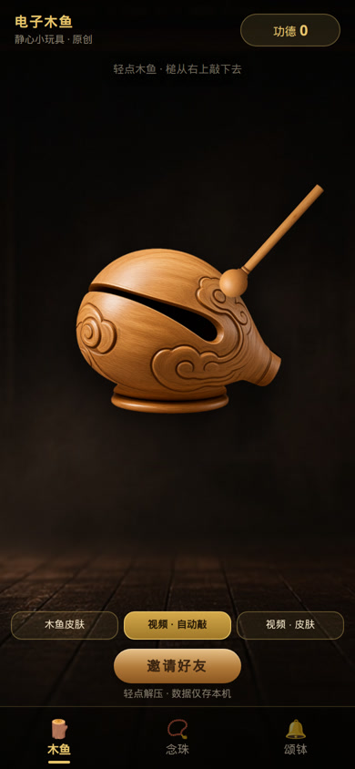
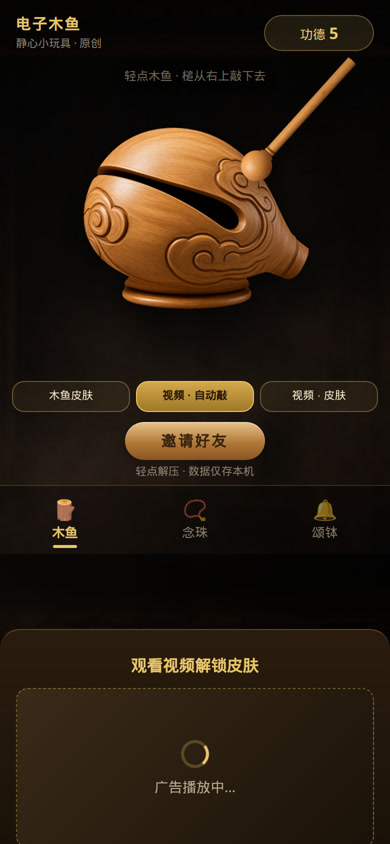
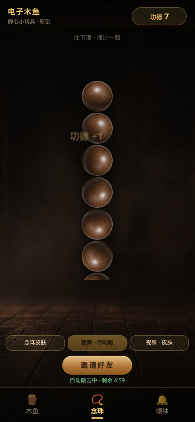
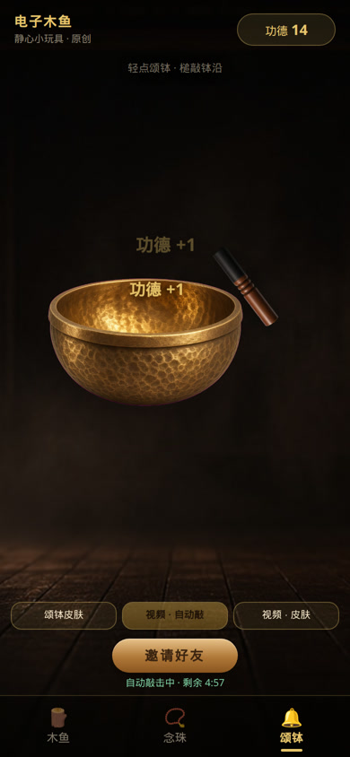

# 电子木鱼 · 全量 UX QA 报告

- **仓库**：https://github.com/1019666077-bit/dianzi-muyu
- **基线**：`main` @ `b27db5a`（*Add WeChat mini program with v1.1 retention and monetization prep.*）
- **日期**：2026-09-16
- **角色**：第一次打开的中文用户 + 挑剔产品评审
- **范围**：遗留 Web `index.html` + 主产品 `mp-weixin/`

## 测试方法（不编造指标）

| 面 | 能跑什么 | 不能跑什么 |
| --- | --- | --- |
| Web `index.html` | 本机 `python3 -m http.server 8848`；Chrome/Puppeteer 390×844 / 375×667 / 1280×800 实操点击、划念珠、假广告、自动敲、刷新持久化。冷启动本机 `networkidle0` **996ms**（localhost，不代表 4G）。 | 真实扬声器听感、真机震动 |
| 小程序 `mp-weixin/` | 静态走读 `app.js` / `pages/*` / `utils/*` / `config/launch.js`；`python tools/validate_mp_assets.py`；用 mock `wx` 对 `utils/merit.js` 做日切/streak/配额单测 **22/22 PASS** | **本 VM 无微信开发者工具 / 无真机 / 无正式 AppID**，无法看模拟器动画、隐私弹窗真机形态、激励视频 SDK |
| 包体 | `du`：`mp-weixin` **0.82MB**；Web `assets/` **12.2MB** | 微信后台「代码包」压缩后体积 |

Web 实操截图（本报告附件）：

---

### 总结（能不能提审 / 体验分 1–10）

**现在不能提审。** `project.private.config.json` 与 `project.config.json` 仍是 `touristappid`；`REWARDED_AD_UNIT_ID` 为空。主界面却有「视频·快敲 / 视频·皮肤」——游客或空广告位会 toast「开发版：已跳过广告」并**直接发奖**。这是审核里典型的虚假广告 / 开发态文案进正式包。个人主体即便有 AppID，在流量主开通前也应把「视频」入口藏掉或改成「暂未开放」，而不是假装看完视频。

**体验分：6 / 10**（按「能上架的解压小玩具」而不是「仓库里的精修截图」打）。

- 木鱼/颂钵视觉、点击反馈、本地计数，作为玩具已经能玩，Web 实操 5 连点计数与「功德 +1」浮字成立。
- v1.1 留存：**逻辑层基本做完，界面半成品**——streak 冻结、广告日剩余次数、本次功德在首页都看不见或文案说错。
- 变现：**骨架真实、发奖路径是 stub**，UI 却写成已经有视频。个人主体会被这条误伤。
- 扣分还来自：首页「重置」不改可见数字、四按钮挤、自动敲无法在数据页暂停、Web 仍是 1.5s 假广告且不能关自动敲。

若只修 P0（正式 AppID + 无广告位时隐藏/禁用视频入口 + 后台隐私指引），并藏住「开发版」toast，作为「免费慢敲解压玩具」有机会过审；**带着当前视频按钮提审，过审概率低**。

---

### 按严重程度的问题清单

#### P0 阻断

**QA-P0-01　未配置正式 AppID，不能真机也不能提审**

- **复现**：打开 `mp-weixin/project.config.json`、`project.private.config.json`。
- **期望**：提审包绑定 `wx` 开头 AppID；游客仅限本机编译。
- **实际**：两处均为 `"appid": "touristappid"`。`config/launch.js` 用 `wx.getAccountInfoSync()` 读运行时 AppID，空或 `touristappid` 则 `IS_TOURIST === true`。`LAUNCH.md` 已写明，但仓库默认仍是游客。
- **建议**：按 `LAUNCH.md` 把正式 AppID 只写入本机 `project.private.config.json`（不要把 AppSecret 与生产 AppID 提交进 git）；提审前用开发者工具确认标题栏不是游客。

**QA-P0-02　「视频」按钮在无广告位时直接发奖，且 toast「开发版：已跳过广告」**

- **复现（逻辑）**：`IS_TOURIST` 或 `REWARDED_AD_UNIT_ID === ""` 时点首页「视频·快敲」或「视频·皮肤」。
- **期望**：未开通流量主时**不出现**「视频」承诺，或按钮写「暂未开放」且不发奖；正式广告必须 `res.isEnded` 才发奖。
- **实际**：
  - `mp-weixin/utils/ad.js`：`canUseRealAd` 为假时 `watchRewarded` toast「开发版：已跳过广告」并立刻 `onSuccess()`。
  - `config/launch.js`：`REWARDED_AD_UNIT_ID: ""`。
  - `pages/index/index.wxml` 仍展示「视频·快敲」「视频·皮肤」。
  - `index.data.isTourist` 已写入，**wxml 未使用**。
- **建议**：`!canUseRealAd()` 时隐藏这两个按钮（个人主体 / 未满 500 UV 的默认路径）；保留免费「自动敲」慢敲。真广告位填上后再显示。禁止正式包出现「开发版」字样。

**QA-P0-03　Web 原型仍用 1.5s 假广告，文案写「广告播放中… / 广告结束 / 领取奖励」**

- **复现**：浏览器打开 `index.html` →「木鱼皮肤」→ 点锁定「紫檀」或点「视频 · 皮肤」。本机已实操，见 `docs/qa-shots/web-04-fake-ad.jpg`。
- **期望**：Web 若只是内部原型，应标明「非上架版本 / 无真实广告」；若还当产品给用户，禁止假装播广告。
- **实际**：`index.html` `AD_MS = 1500`，`showAd()` 显示「观看视频解锁皮肤」「广告播放中…」，1.5s 后「广告结束」「领取奖励」。`<title>` 仍是「电子木鱼 · 原作原型」。仓库 `shots/` 里更旧的截图还写「看广告解锁」「本地演示」，与当前 HTML 也不一致。
- **建议**：Web 去掉假广告层，锁定皮肤改为「小程序内解锁」或直接免费；标题去掉「原型」。不要把 `index.html` 塞进 web-view 去提审。

---

#### P1 体验伤 / 合规伤

**QA-P1-01　快敲结束文案在「当日第 1/2 次」就说明天再来**

- **复现**：看一次视频（或开发跳过）快敲 5 分钟结束，且未开慢敲。
- **期望**：当日额度 2 次；第一次结束后应提示还可以再看；用尽 2/2 才说明天。
- **实际**：`pages/index/index.js` `updateAutoStatus()` 用 `adGrantAutoCount > 0` 就切换到「今日快敲已结束 · 明天可再看视频续 5 分钟 · 慢敲仍可用」。第一次用完 5 分钟就会撒谎，尽管 `canGrantAuto` 仍为 true。
- **建议**：仅当 `!canGrantAuto(state)` 时用「已结束/明天」；否则写「快敲已停 · 今日还可再看 N 次」。

**QA-P1-02　首页「重置」清的是「本次功德」，但首页根本不展示本次**

- **复现**：侧栏点「重置」→ 确认「将本次功德清零，今日与总计不受影响」→ toast「已重置本次」。
- **期望**：重置对象在当前屏可见；或重置入口只放在数据页「本次功德」旁。
- **实际**：首页 pill 是「今日 / 总」。`merit.resetSession` 只清 `sessionMerit`（`utils/merit.js`）。用户会以为坏了或点了没反应。
- **建议**：首页侧栏重置改为进入数据页，或重置前在弹窗里带上当前本次数字；首页不要放一个看不见效果的按钮。

**QA-P1-03　进入数据页后自动敲仍继续计次并播音**

- **复现**：开慢敲或快敲 → 点「数据」`navigateTo` 统计页。
- **期望**：离开敲击页时暂停计时器与 `InnerAudioContext`；返回再续（快敲剩余时间可继续扣，但不要在数据页「咚咚咚」）。
- **实际**：`pages/index/index.js` 只有 `onUnload` 清 timer；`navigateTo` 不会 unload。无 `onHide`。统计页会一边看数字一边被后台 `setInterval` 50–120 次/分钟地 `bump()`。
- **建议**：`onHide` `clearAutoTimers` + `audio.stop`；`onShow` 再 `restartAutoLoop`。

**QA-P1-04　右侧竖栏与木鱼/颂钵热区重叠**

- **复现**：约 375–390 宽屏。`.tap-area` 宽 300px 居中，`.side-rail` `right: 10px`、宽 48px。
- **期望**：点木鱼右侧不应误触「数据 / 重置 / 自动」。
- **实际**：375 宽时舞台右缘约 337px，栏左缘约 317px，重叠约 20px（`pages/index/index.wxss`）。
- **建议**：栏改 `top` 到舞台外或缩小舞台宽度；热区 `catchtap` 不要让栏浮在槌上。

**QA-P1-05　隐私文案与真实本地写入不一致；真广告后「无第三方」会假**

- **复现**：对照 `mp-weixin/PRIVACY.md` 与代码写入。
- **期望**：隐私指引覆盖全部本地字段；有流量主时声明腾讯广告；拒绝隐私后所有 `setStorage` 都停。
- **实际**：
  - 指引只写功德、皮肤、自动敲剩余。
  - 未写：`streakDays` / 冻结、`adGrant*` 配额、`dianzi-muyu-scene-stats` 场景值、`dianzi-muyu-hints`。
  - `app.js` `recordScene`、`maybeShowMyMiniProgramHint` **不走** `whenPrivacy`。
  - 填了广告位后仍写「第三方共享：无」。
- **建议**：更新 `PRIVACY.md` 并同步 MP 后台。场景统计与 hint 同样守隐私门。开通流量主后补「广告由腾讯广告提供」。

**QA-P1-06　连续天数「每月一次冻结」对用户是黑箱（v1.1 半成品）**

- **复现**：连续敲 3 天 → 隔一天再敲。`merit.updateStreak` 会 `streakFreezeUsed=true` 且天数 +1。数据页只显示「已连续 N 天」。
- **期望**：要么告诉用户「本月已使用 1 次补签」，要么不要做冻结（隔一天就断）。
- **实际**：冻结无任何 UI；「清空全部功德」也不清 streak（`resetAllMerit`），用户会觉得「数据清空了怎么还连续」。
- **建议**：数据页展示冻结状态；清空全部时同时清 streak，或文案写明「连续天数保留」。

**QA-P1-07　广告解锁皮肤不绑定「点下去时的模式」**

- **复现**：木鱼锁定紫檀 → 点「需解锁」开始看视频 → 看的过程切到念珠 → 发奖。
- **期望**：解锁开始时所在模式的那件皮肤。
- **实际**：`pendingAd = "skin"`，`grantSkin()` 用**当时**的 `this.data.mode` 和 `firstLockedSkin()`。可能把额度花在另一模式，或目标模式已全部解锁则白看（此时 `recordGrantSkin` 前 return，额度还在，但用户莫名其妙）。
- **建议**：`showAd('skin')` 时记下 `mode + skinId`。

**QA-P1-08　工具栏四个 11px 按钮 + 侧栏「自动」重复，首屏像投放后台**

- **复现**：冷启动看 `pages/index/index.wxml` 底栏：`木鱼皮肤 | 自动敲 | 视频·快敲 | 视频·皮肤`，再加超大「邀请好友」，右侧再一个「自动」。
- **期望**：第一次打开先会敲，再发现皮肤/自动；邀请不应比木鱼更大。
- **实际**：四个 `font-size: 11px; white-space: nowrap`（`index.wxss`）。个人主体用户会先撞上两个「视频」。
- **建议**：底栏保留「皮肤 + 自动敲」；视频入口放皮肤 sheet 内；邀请改成系统胶囊转发，不要金大钮压过玩法。

**QA-P1-09　Web 自动敲一旦开始无法停止，刷新还会接着敲**

- **复现**：Web 点「视频 · 自动敲」→ 假广告领取 → 按钮 `disabled`，状态「自动敲击中 · 剩余 m:ss」。刷新：`autoUntil` 仍在未来，本机实操刷新后功德从 20 继续涨到 21+。
- **期望**：与小程序 v1.1 一样能关；刷新后应可停。
- **实际**：`index.html` `btnAdAuto.disabled = true`，无关闭；`startAutoIfNeeded()` 启动时恢复。
- **建议**：进行中按钮改为「停止自动」；或到期前允许再次点击停止。

**QA-P1-10　README / 文档与产品事实打架，会误导提审准备**

- **复现**：读根目录 `README.md`。
- **期望**：主产品路径、广告真假、皮肤套数、音效来源与代码一致。
- **实际**：README 仍写 Web Audio「无外部音频」、1.5s mock、精修+经典六套木鱼。小程序实际：wav 采样、`ad.js` 真 SDK 骨架、木鱼只有三套分层 premium。`tools/GROK-REMAINING-TASKS.md` 的 Done 表还写「经典/精修分组、premium-test」——代码里分组 label 为空、id 已迁移成 amber/jade/inkgold。
- **建议**：README 改成「产品 = mp-weixin，Web = 过时对照原型」；或把 Web 标 deprecated。

---

#### P2 小瑕疵

**QA-P2-01　第一次敲击被「添加到我的小程序」模态打断**

- `bump()` 在 `todayMerit===1 || total===1` 时 `wx.showModal`。解压节奏被系统弹窗掐断。可改成 3–5 次敲击后的非模态条，或放数据页。

**QA-P2-02　`InnerAudioContext.obeyMuteSwitch = false`**

- 静音档仍出声。解压玩具在地铁上会社死。应尊重静音，并给一个可选「扬声器」开关。

**QA-P2-03　快敲 550ms + 震动 + 颂钵 2.1s wav**

- `bowl.wav` 时长 2.10s / 185KB；快敲 550ms 会 `stop(); seek(0); play()` 砍掉余音。慢敲 1200ms 也会砍。颂钵自动敲听感会「碎」。自动敲颂钵应拉长间隔或用短 hit 采样。

**QA-P2-04　念珠 hint「拨过一颗」，一次下滑可连加多颗**

- Web 实操一次 pointer 下滑功德 8→12（+4）。`onBeadMove` / `commitBeadSlide` 每 64px 一颗。hint 与手感不一致；也容易被当成刷计数。可在 hint 写「下滑越多拨得越多」，或加轻量节流。

**QA-P2-05　Tab 用 Emoji（🪵📿🔔），部分环境念珠图标会变成方块/「Q」**

- Linux Chrome 实操：念珠 tab 图标不像念珠（见附件冷启动/念珠图）。微信 iOS 通常尚可。应用 `assets/ui` 同样画 tab 图标。

**QA-P2-06　性能风险（小程序）**

- 单次木鱼点击：`bump` 两次 `setData`（计数 + 浮字）+ `restart()` 每个动画 flag 三次 `setData`（bodyHit / muyuSwing / muyuFlash）≈ 11 次/击。快敲约 1.8 击/秒，另有 500ms 倒计时 `setData`。念珠 `touchmove` 每次都 `setData({ beadOffset })`。
- 木鱼一屏最多 6 张分层 WebP。包体 0.82MB 可接受，但低端安卓会掉帧。
- 建议：动画用 CSS class 一次切；move 用 transform 不 `setData`；浮字数量 cap=3。

**QA-P2-07　性能风险（Web）**

- `assets/` 合计 **12.2MB**。冷启动 HTML 就请求木鱼 body 477KB、颂钵 504KB（隐藏 panel 也会加载）、槌、三套 wav、背景。`bg-zen.png` 实际是 **JPEG 1280×720** 却叫 `.png`。紫檀念珠 PNG **946KB** 却显示成 64px。应学小程序改 WebP 并 `loading` 懒加载非当前模式。

**QA-P2-08　分享/邀请文案偏「积功德」，Web 更明显**

- 小程序浮字已是 `+1`，分享标题「今日敲击 N 次 · 电子木鱼」较稳。
- Web：`FLOAT_TEXTS`「功德 +1」；邀请「一起敲、一起积功德」；`navigator.share` text「来一起敲木鱼积功德」。
- 未出现「开光 / 消业 / 灵验 / 法事」。宗教类目风险中等，但提审说明应坚持「解压玩具」。Web 建议与小程序对齐成「+1 / 解压」。

**QA-P2-09　无支付，但「视频解锁」在个人主体上仍像 IAP 替代品**

- 全仓库无 `requestPayment` / `wx.login` / 用户信息。这点是干净的。
- 风险在于：个人主体未开通流量主时用视频按钮发奖（见 P0-02），审核会当成诱导或虚假广告，而不是「没做支付所以安全」。

**QA-P2-10　游客态无任何角标**

- `isTourist` 已在 data。应在底栏或设置里写「本机调试 · 未接广告」，避免自己提审时忘记。

**QA-P2-11　`scripts/upload.ps1` 写死别人的 Windows 路径**

- `D:\微信web开发者工具\cli.bat`、`C:\Users\MOON\Desktop\dianzi-muyu\mp-weixin`。别人克隆即失败。改成相对路径或文档说明。

**QA-P2-12　`project.config.json` `urlCheck: false`**

- 当前无 `wx.request`，暂无外链。提审前建议改回 true，避免以后随手加域名却不配合法域名。

**QA-P2-13　Web 假广告主按钮在截图里贴底，小屏可能要滑**

- DOM 确认 1.5s 后 `#adClose` 文案为「领取奖励」且 `disabled=false`；390×844 截图几乎看不到该按钮（卡片里 160px 虚线框占高）。给真用户会造成「广告结束了点哪里」。

---

#### P3 建议

**QA-P3-01** `beadBusy` 在小程序里赋值后从未改成 true，是死代码。  
**QA-P3-02** `index.wxss` 仍留 `.ad-box` / `.spinner`（假广告 UI 已删）。  
**QA-P3-03** Web `DEFAULT_SKINS` 未使用。  
**QA-P3-04** `tools/` 下多份 GROK 任务书互相矛盾（有的说接真广告，有的说保持 1.5s 模拟）。不要当产品文档。  
**QA-P3-05** 桌面打开 Web 是 390×844 居中黑边——作为手机原型可接受，可加一句「请用手机打开」。  
**QA-P3-06** 时钟回拨 / 时区跨越会打乱 `localDateKey` streak（本地产品可接受，不必上服务器）。  
**QA-P3-07** 皮肤内部 id `jade` 展示名「花梨」，避免以后运营文档写错。  
**QA-P3-08** 无音量/静音开关、无首次 0.5 秒引导动画（槌敲一下）。  
**QA-P3-09** `enableShareAppMessage` 未在 `index.json` 声明（有 `onShareAppMessage` + `open-type="share"`，多数基础库可用；建议按当前文档补字段）。  

---

### v1.1 留存 / 变现对照（声称 vs 代码 vs 体感）

依据 `tools/CHANGELOG-DAILY-RETENTION.md`、`tools/GROK-IMPLEMENT-DAILY-RETENTION.md`。单测覆盖 streak 连续三天、隔一天冻结、二次缺口断档、快敲 2 次/皮肤 3 次日切。

| 声称 | 代码 | 体感 |
| --- | --- | --- |
| schema v3 streak + 月冻结 | 有，逻辑正确 | 只在数据页一行「已连续 N 天」；冻结完全不可见 → **半成品** |
| 顶栏主数字改今日 | 有 | 完成，且可点进数据页 |
| 数据页四行 + 昨日缺口 | 有 | 完成；首页看不到缺口 → 留存钩子偏藏 |
| 分享标题带今日次数 + share-cover | 有；封面 500×400、18.5KB（校验通过，≤128KB） | 完成；邀请钮过大 |
| 首次引导「我的小程序」 | 有，独立 storage | 完成但太早、太冲 |
| 快敲 2 次/日、皮肤 3 次/日 | 有，开发跳过也计数 | 完成；结束文案在 1/2 次就说「明天」（P1-01） |
| 快敲结束不连弹广告 | 无自动 `showAd` | 完成 |
| 场景值 1089/1036/1053 本地统计 | `app.js` + 数据页标题连点 5 次 | 调试功能，用户无感知 → 可接受 |
| 不做订阅/云开发 | 无 `wx.login` / 订阅 | 符合决策 |
| 激励视频 | `createRewardedVideoAd` 骨架真实；unit 空则跳过 | **UI 像已接，运行是 stub** |
| 个人主体 | `LAUNCH.md` 有提醒 | **产品 UI 没按个人主体降级** |

Web **没有** v1.1：无今日/昨日、无 streak、无慢敲、无数据页、广告仍是 setTimeout。同一 storage key `dianzi-muyu-v1` 若将来把 Web 塞进 web-view，Web `save()` 会把 v3 字段写丢。

---

### 权限 / 隐私 / 游客 AppID 行为

| 项 | 事实 |
| --- | --- |
| `app.json` | 无 `permission` / `requiredPrivateInfos`；`"__usePrivacyCheck__": true` |
| 用到的 API | 本地存储、隐私授权、短震动、内部音频、激励视频（条件）、分享、导航、菜单按钮矩形、账号信息 |
| 未用 | 定位、相册、通讯录、麦克风、摄像头、登录、支付 |
| 游客 | 广告跳过并发奖；隐私 API 若没有则直接 `privacyAgreed=true` 并落盘 |
| 拒绝隐私 | `save()` 不写 `dianzi-muyu-v1`，内存里仍涨数，杀进程丢失；toast「未同意隐私协议，进度将不保存」——这条是对的 |
| 后台 | `PRIVACY.md` 需粘贴到 MP「用户隐私保护指引」；未发布则真机 `__usePrivacyCheck__` 可能拦存储 |

---

### 体验亮点

1. **木鱼精修分层**（body/shade/spec/ground/rim/mallet）和禅寺背景，Web 冷启动已经像能上架的皮肤，而不是 CSS 圆角木鱼。
2. **颂钵槌在 Web 上可见且比例正常**（约 20×103px，黄铜 `mallet-flip`）；小程序侧已用 `heightFix` + 固定父宽，对症了历史「宽度 0」问题（本 VM 不能模拟器确认，但结构不再是 `width: auto` + `aspectFit`）。
3. **念珠改竖串下滑**，比仓库旧截图的圆环更跟手；有拨动位移。
4. **数据仅本机、无登录无支付**，定位「静心小玩具 · 原创」和竞品「功德木鱼」有区隔。
5. **免费慢敲**是个人主体正确底座；快敲才走激励，没有一上来插屏。
6. **功德数据页**结构清楚（本次/今日/昨日/总 + 分模式），清空全部有二次确认。
7. **小程序资源克制**：校验无缺文件，包 **0.82MB**，分享图合规尺寸。
8. **存档迁移**把 `premium-test` 等旧 id 映射到 amber/jade/inkgold，避免老用户皮肤丢失。
9. **浮字小程序用 `+1`** 而不是满屏「功德」，比 Web 更利于过审。

---

### 提审前必做 checklist

**阻断（不做则不要点上传）**

- [ ] 注册小程序，`project.private.config.json` 填入正式 `wx` AppID，开发者工具标题栏不再是游客。
- [ ] MP 后台发布「用户隐私保护指引」（用更新后的 `PRIVACY.md`，含 streak / 配额 / 场景统计）。
- [ ] **无流量主 / 个人主体未开通广告：隐藏「视频·快敲」「视频·皮肤」**，只留免费慢敲 + 免费皮肤；或按钮 disable 文案「暂未开放」。
- [ ] 正式包 **禁止** toast「开发版：已跳过广告」。
- [ ] 类目走「工具-效率」或「文娱-休闲」，简介不要法事/灵验；不要用竞品名「功德木鱼」。
- [ ] 上传前用真机：木鱼/念珠/颂钵各玩 20 下、杀进程重进、计数还在。

**强烈建议（不做也能传，但容易打回或体验分低）**

- [ ] 修 QA-P1-01 快敲结束文案。
- [ ] 首页去掉无效「重置」，或 `onHide` 停自动敲。
- [ ] 侧栏避让热区。
- [ ] 皮肤广告记下 mode+id。
- [ ] 底栏减到 2 个主按钮；邀请不要压过木鱼。
- [ ] 第一次引导不要挡在第一击上。
- [ ] `urlCheck` 改回 true。
- [ ] 音频尊重静音档。
- [ ] README 改成与小程序事实一致；Web 标成对照原型，去掉假广告。
- [ ] 真机确认颂钵槌、念珠滑动、胶囊避让（本报告未能跑微信模拟器）。
- [ ] 流量主开通后：填 `REWARDED_AD_UNIT_ID`，真机看完才发奖、中途退出不发奖；隐私补第三方广告。

**不要做（会减过审概率）**

- [ ] 不要在快敲结束自动再弹激励。
- [ ] 不要做「不分享不能玩 / 分享领奖励」。
- [ ] 不要上支付、排行榜、云功德墙。
- [ ] 不要把 `index.html` 的假广告页当小程序首页。
- [ ] 不要把 AppSecret 写进仓库。

---

### 附录 A　merit.js 单测（本 VM）

在 mock `wx` + 冻结本地日期下：

- 默认 schema 3、免费皮肤写入、streak 从 0 起
- 同日连敲 streak 不叠加
- v2→v3 迁移、`premium-jade`→`jade`、跨日 rollover 今日清零昨日继承
- 连续三天 streak=3；隔一天走月冻结 streak=4；同月第二次缺口 streak=1
- 快敲 2 次后拦截、皮肤 3 次后拦截、次日配额恢复
- `resetAllMerit` 清计数（streak 保留——见 QA-P1-06）

**22/22 PASS**。留存逻辑本身不是拍脑袋，缺的是把状态讲给用户。

### 附录 B　资源抽查

| 文件 | 测得 |
| --- | --- |
| `mp-weixin` 合计 | 0.82MB，validate 无缺失 |
| `share-cover.webp` | 500×400，18.5KB |
| `bowl.wav` | 44.1kHz mono，2.10s，185KB |
| `bead-rosewood.webp` | 790×800，90.8KB（显示 64px） |
| Web `assets/` | 12.2MB；`bead-rosewood.png` 946KB；`bowl-cushion-brass.png` 980KB（Web 已不用坐垫，但仍占仓库） |

---

*本报告只描述已观察到的代码与本机 Web 行为。小程序动画/隐私弹窗/激励 SDK 必须以微信开发者工具 + 真机再验一遍。*
